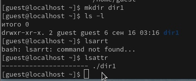
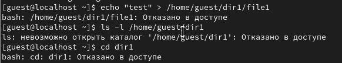
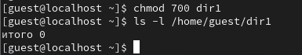

---
## Front matter
lang: ru-RU
title: Лабораторная работа №2
author:
  - Дорофеева Алёна Тимофеевна
institute:
  - Российский университет дружбы народов, Москва, Россия
date: 16.09.2023

## i18n babel
babel-lang: russian
babel-otherlangs: english

## Formatting pdf
toc: false
toc-title: Содержание
slide_level: 2
aspectratio: 169
section-titles: true
theme: metropolis
header-includes:
 - \metroset{progressbar=frametitle,sectionpage=progressbar,numbering=fraction}
 - '\makeatletter'
 - '\beamer@ignorenonframefalse'
 - '\makeatother'
---

## Тема лабораторной работы

Дискреционное разграничение прав в Linux. Основные атрибуты.

## Цель выполнения лабораторной работы

Получение практических навыков работы в консоли с атрибутами файлов, закрепление теоретических основ дискреционного разграничения доступа в современных системах с открытым кодом на базе ОС Linux.

## Задачи 

1. Создание учётной записи пользователя guest
2. Выполнение базовых операций с директориями и файлами
3. Заполнение таблицы "Установленные права и разрешённые действия" опытным путем
4. Заполнение таблицы "Минимальные права для совершения операций" на основании заполненной таблицы 

# Выполнение лабораторной работы 

## 1. Создала учётную запись пользователя guest (используя учётную запись администратора) и задала пароль (рис 1).

{ #fig:001 width=50% }

## 2. Выполнила базовые операций с директориями и файлами (рис 2-4).

{ #fig:002 width=50% }
{ #fig:002 width=50% }
{ #fig:002 width=50% }

## 3. Заполнила таблицу «Установленные права и разрешённые действия» 

Таблица 1. Установленные права и разрешённые действия
|Права директории|Права файла|Созд. ф-ла|Удал. ф-ла|Зап. в ф-л|Чт. ф-ла|Смена д-ии|Просм. ф-в в д-ии|Переим. ф-ла|См. атр. ф-ла|
|----------|----------|----------|----------|----------|--------|----------|----------|------------|--------|
|(000)     |(000)     |-         |-         |-         |-       |-         |-         |-           |-       |
|(100)     |(000)     |-         |-         |-         |-       |+         |-         |-           |+       |
|(300)     |(000)     |+         |+         |-         |-       |+         |-         |+           |+       |
|(500)     |(000)     |-         |-         |-         |-       |+         |+         |-           |+       |s
|(700)     |(000)     |+         |+         |-         |-       |+         |+         |+           |+       |
...
|(100)     |(700)     |-         |-         |+         |+       |+         |-         |-           |+       |
|(300)     |(700)     |+         |+         |+         |+       |+         |-         |+           |+       |
|(500)     |(700)     |-         |-         |+         |+       |+         |+         |-           |+       |
|(700)     |(700)     |+         |+         |+         |+       |+         |+         |+           |+       |

## 4. Заполнила таблицу "Минимальные права для совершения операций" 

Таблица 2. Минимальные права для совершения операций
|Операция              |Мин. права на директорию|Мин. права на файл|
|----------------------|------------------------|------------------|
|Создание файла        |d-wx------ (300)        |0                 |
|Удаление файла        |d-wx------ (300)        |0                 |
|Чтение файла          |d--x------ (100)        |-r-------- (400)  |
|Запись в файл         |d--x------ (100)        |--w------- (200)  |
|Переименование файла  |d-wx------ (300)        |0                 |
|Создание поддиректории|d-wx------ (300)        |0                 |
|Удаление поддиректории|d-wx------ (300)        |0                 |

## Вывод

В ходе лабораторной работы получены практические навыки работы в консоли с атрибутами файлов, также закрепили теоретические основы дискреционного разграничения доступа в современных системах с открытым кодом на базе ОС Linux.

