---
## Front matter
title: "Отчет по лабораторной работе №2"
subtitle: "Дисциплина: Информационная безопасность"
author: "Дорофеева Алёна Тимофеевна"

## Generic otions
lang: ru-RU
toc-title: "Содержание"

## Bibliography
bibliography: bib/cite.bib
csl: pandoc/csl/gost-r-7-0-5-2008-numeric.csl

## Pdf output format
toc: true # Table of contents
toc-depth: 2
lof: true # List of figures
lot: true # List of tables
fontsize: 12pt
linestretch: 1.5
papersize: a4
documentclass: scrreprt

## I18n polyglossia003-lab_markdown.pdf
polyglossia-lang:
  name: russian
  options:
	- spelling=modern
	- babelshorthands=true
polyglossia-otherlangs:
  name: english
## I18n babel
babel-lang: russian
babel-otherlangs: english
## Fonts
mainfont: PT Serif
romanfont: PT Serif
sansfont: PT Sans
monofont: PT Mono
mainfontoptions: Ligatures=TeX
romanfontoptions: Ligatures=TeX
sansfontoptions: Ligatures=TeX,Scale=MatchLowercase
monofontoptions: Scale=MatchLowercase,Scale=0.9
## Biblatex
biblatex: true
biblio-style: "gost-numeric"
biblatexoptions:
  - parentracker=true
  - backend=biber
  - hyperref=auto
  - language=auto
  - autolang=other*
  - citestyle=gost-numeric
## Pandoc-crossref LaTeX customization
figureTitle: "Рис."
tableTitle: "Таблица"
listingTitle: "Листинг"
lofTitle: "Список иллюстраций"
lotTitle: "Список таблиц"
lolTitle: "Листинги"
## Misc options
indent: true
header-includes:
  - \usepackage{indentfirst}
  - \usepackage{float} # keep figures where there are in the text
  - \floatplacement{figure}{H} # keep figures where there are in the text
---

# Цель работы

Получение практических навыков работы в консоли с атрибутами файлов, закрепление теоретических основ дискреционного разграничения доступа в современных системах с открытым кодом на базе ОС Linux.

# Задание
1. Создание учётной записи пользователя guest
2. Выполнение базовых операций с директориями и файлами
3. Заполнение таблицы "Установленные права и разрешённые действия" опытным путем
4. Заполнение таблицы "Минимальные права для совершения операций" на основании заполненной таблицы

# Выполнение лабораторной работы

1. В установленной операционной системе создайте учётную запись пользователя guest (использую учётную запись администратора):
useradd guest и задайте пароль для пользователя guest (использую учётную запись администратора):
passwd guest. (рис. 1)

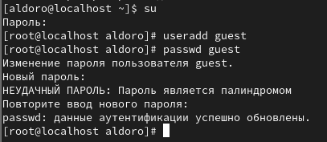{#fig:001 width=70%}

2. Войдите в систему от имени пользователя guest. (рис. 2)

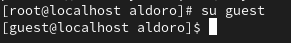{#fig:001 width=70%}

3. Определите директорию, в которой вы находитесь, командой pwd. Сравните её с приглашением командной строки. Зайдите в домашнюю директорию. (рис. 3)

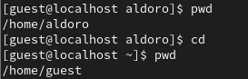{#fig:001 width=70%}

4. Уточните имя вашего пользователя командой whoami. (рис. 4)

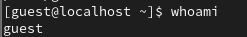{#fig:001 width=70%}

5. Уточните имя вашего пользователя, его группу, а также группы, куда входит пользователь, командой id. Выведенные значения uid, gid и др. запомните. Сравнение вывода id с выводом команды groups. (рис. 5-6)

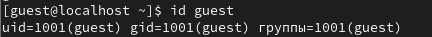{#fig:001 width=70%}
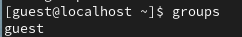{#fig:001 width=70%}

6. Сравните полученную информацию об имени пользователя с данными,
выводимыми в приглашении командной строки.

7. Просмотрите файл /etc/passwd командой
cat /etc/passwd
Найдите в нём свою учётную запись. Определите uid пользователя.
Определите gid пользователя. Сравните найденные значения с полученными в предыдущих пунктах. (рис. 6)

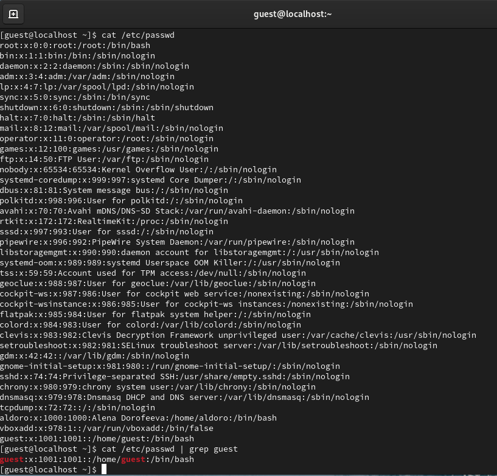{#fig:001 width=70%}

Замечание: использовала программу grep в качестве фильтра для вывода только строк, содержащих определённые буквенные сочетания:
cat /etc/passwd | grep guest

8. Определите существующие в системе директории командой
ls -l /home/
Мне удалось получить список поддиректорий директории /home. Права на директориях установлены такие: drwx------, одинаковы для обеих поддиректорий (рис. 7)

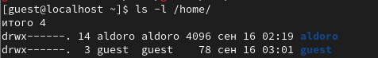{#fig:001 width=70%}

9. Проверьте, какие расширенные атрибуты установлены на поддиректориях, находящихся в директории /home, командой:
lsattr /home
Мне удалось увидеть расширенные атрибуты директории. Однако не удалось увидеть расширенные атрибуты директорий других пользователей. (рис. 8)

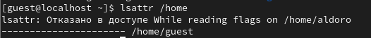{#fig:001 width=70%}

10. Создайте в домашней директории поддиректорию dir1 командой
mkdir dir1
Определите командами ls -l и lsattr, какие права доступа и расширенные атрибуты были выставлены на директорию dir1. (рис. 9)

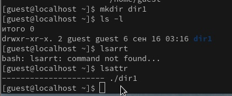{#fig:001 width=70%}

11. Снимите с директории dir1 все атрибуты командой
chmod 000 dir1
и проверьте с её помощью правильность выполнения команды
ls -l (рис. 10)

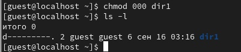{#fig:001 width=70%}

12. Попытайтесь создать в директории dir1 файл file1 командой
echo "test" > /home/guest/dir1/file1
Получила отказ в выполнении операции по созданию файла, потому что недосточно прав. (рис. 11)
Проверила командой ls -l /home/guest/dir1, действительно - файл file1 не находится внутри директории dir1. (рис. 12)

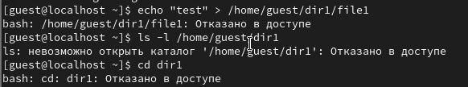{#fig:001 width=70%}

{#fig:001 width=70%}

13. Заполните таблицу «Установленные права и разрешённые действия»
(табл. 1), выполняя действия от имени владельца директории (файлов), определив опытным путём, какие операции разрешены, а какие нет.
Если операция разрешена, занесите в таблицу знак «+», если не разрешена, знак «-». 

Таблица 1. Установленные права и разрешённые действия

|Права директории|Права файла|Созд. ф-ла|Удал. ф-ла|Зап. в ф-л|Чт. ф-ла|Смена д-ии|Просм. ф-в в д-ии|Переим. ф-ла|См. атр. ф-ла|
|----------|----------|----------|----------|----------|--------|----------|----------|------------|--------|
|(000)     |(000)     |-         |-         |-         |-       |-         |-         |-           |-       |
|(100)     |(000)     |-         |-         |-         |-       |+         |-         |-           |+       |
|(200)     |(000)     |-         |-         |-         |-       |-         |-         |-           |-       |
|(300)     |(000)     |+         |+         |-         |-       |+         |-         |+           |+       |
|(400)     |(000)     |-         |-         |-         |-       |-         |+         |-           |-       |
|(500)     |(000)     |-         |-         |-         |-       |+         |+         |-           |+       |
|(600)     |(000)     |-         |-         |-         |-       |-         |+         |-           |-       |
|(700)     |(000)     |+         |+         |-         |-       |+         |+         |+           |+       |
|(100)     |(100)     |-         |-         |-         |-       |+         |-         |-           |+       |
|(300)     |(100)     |+         |+         |-         |-       |+         |-         |+           |+       |
|(500)     |(100)     |-         |-         |-         |-       |+         |+         |-           |+       |
|(700)     |(100)     |+         |+         |-         |-       |+         |+         |+           |+       |
|(100)     |(200)     |-         |-         |+         |-       |+         |-         |-           |+       |
|(300)     |(200)     |+         |+         |+         |-       |+         |-         |+           |+       |
|(500)     |(200)     |-         |-         |+         |-       |+         |+         |-           |+       |
|(700)     |(200)     |+         |+         |+         |-       |+         |+         |+           |+       |
|(100)     |(300)     |-         |-         |+         |-       |+         |-         |-           |+       |
|(300)     |(300)     |+         |+         |+         |-       |+         |-         |+           |+       |
|(500)     |(300)     |-         |-         |+         |-       |+         |+         |-           |+       |
|(700)     |(300)     |+         |+         |+         |-       |+         |+         |+           |+       |
|(100)     |(400)     |-         |-         |-         |+       |+         |-         |-           |+       |
|(300)     |(400)     |+         |+         |-         |+       |+         |-         |+           |+       |
|(500)     |(400)     |-         |-         |-         |+       |+         |+         |-           |+       |
|(700)     |(400)     |+         |+         |-         |+       |+         |+         |+           |+       |
|(100)     |(500)     |-         |-         |-         |+       |+         |-         |-           |+       |
|(300)     |(500)     |+         |+         |-         |+       |+         |-         |+           |+       |
|(500)     |(500)     |-         |-         |-         |+       |+         |+         |-           |+       |
|(700)     |(500)     |+         |+         |-         |+       |+         |+         |+           |+       |
|(100)     |(600)     |-         |-         |+         |+       |+         |-         |-           |+       |
|(300)     |(600)     |+         |+         |+         |+       |+         |-         |+           |+       |
|(500)     |(600)     |-         |-         |+         |+       |+         |+         |-           |+       |
|(700)     |(600)     |+         |+         |+         |+       |+         |+         |+           |+       |
|(100)     |(700)     |-         |-         |+         |+       |+         |-         |-           |+       |
|(300)     |(700)     |+         |+         |+         |+       |+         |-         |+           |+       |
|(500)     |(700)     |-         |-         |+         |+       |+         |+         |-           |+       |
|(700)     |(700)     |+         |+         |+         |+       |+         |+         |+           |+       |

14. На основании заполненной таблицы определите те или иные минимально необходимые права для выполнения операций внутри директории
dir1, заполните табл. 2.

Таблица 2. Минимальные права для совершения операций
|Операция              |Мин. права на директорию|Мин. права на файл|
|----------------------|------------------------|------------------|
|Создание файла        |d-wx------ (300)        |0                 |
|Удаление файла        |d-wx------ (300)        |0                 |
|Чтение файла          |d--x------ (100)        |-r-------- (400)  |
|Запись в файл         |d--x------ (100)        |--w------- (200)  |
|Переименование файла  |d-wx------ (300)        |0                 |
|Создание поддиректории|d-wx------ (300)        |0                 |
|Удаление поддиректории|d-wx------ (300)        |0                 |

# Выводы

В ходе лабораторной работы получены практические навыки работы в консоли с атрибутами файлов, также закрепили теоретические основы дискреционного разграничения доступа в современных системах с открытым кодом на базе ОС Linux.

# Список литературы{.unnumbered}

::: {#refs}
:::
