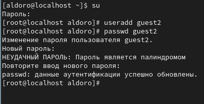
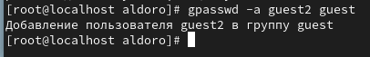
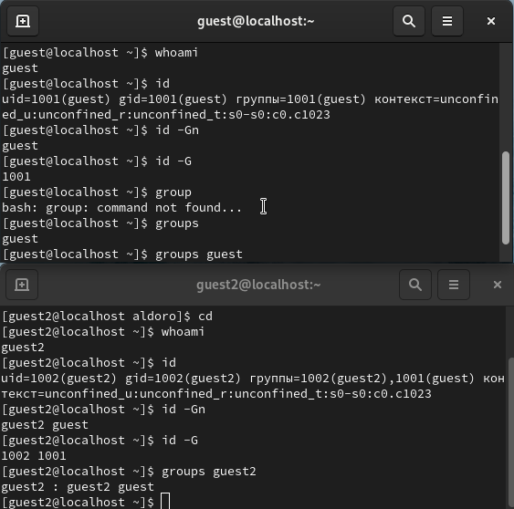
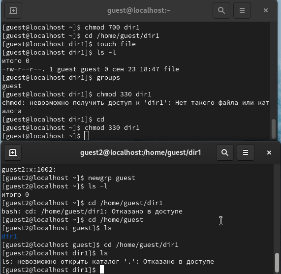

---
## Front matter
lang: ru-RU
title: Лабораторная работа №3
subtitle: Дискреционное разграничение прав в Linux. Два пользователя
author:
  - Дорофеева А. Т.
institute:
  - Российский университет дружбы народов, Москва, Россия
  - Объединённый институт ядерных исследований, Дубна, Россия
date: 23 января 2023

## i18n babel
babel-lang: russian
babel-otherlangs: english

## Formatting pdf
toc: false
toc-title: Содержание
slide_level: 2
aspectratio: 169
section-titles: true
theme: metropolis
header-includes:
 - \metroset{progressbar=frametitle,sectionpage=progressbar,numbering=fraction}
 - '\makeatletter'
 - '\beamer@ignorenonframefalse'
 - '\makeatother'
---

# Информация

## Докладчик

:::::::::::::: {.columns align=center}
::: {.column width="70%"}

  * Дорофеева АЛёна Тимофеевна
  * студент(-ка) уч. группы НПИбд-01-20
  * Российский университет дружбы народов
  * [1032201392@pfur.ru](mailto:1032201392@rudn.ru)
  * <https://github.com/DorofeevaAT/study_2022-2023_infosec>

## Тема лабораторной работы

Дискреционное разграничение прав в Linux. Два пользователя

## Зачем выполнять лабораторную работу?

- В процессе работы нередки случаи необходимости работы с директориями и файлами. Лабораторная работа обучает всем базовым навыкам работы с директориями и файлами
- Важно знать о том, какие бывают права у файлов и директорий и что происходит в разных комбинациях прав
- Необходимо уметь работать с правами нескольких пользователей

## Цель выполнения лабораторной работы

Получение практических навыков работы в консоли с атрибутами файлов для групп пользователей.

## Задачи 

1. Создание учётной записи пользователя guest2
2. Выполнение базовых операций с директориями и файлами
3. Заполнение таблицы "Установленные права и разрешённые действия" опытным путем
4. Заполнение таблицы "Минимальные права для совершения операций" на основании заполненной таблицы 

# Краткий процесс выполнения лабораторной работы

## 1 шаг

Создала учётную запись пользователя guest2 и задала пароль (используя учётную запись администратора) (рис -@fig:001).

{ #fig:001 width=50% }

## 2 шаг

Добавила пользователя guest2 в группу guest и вошла в систему от двух пользователей (рис -@fig:003).

{ #fig:003 width=50% }

## 2 шаг

Выполнила базовые операций с директориями и файлами (рис -@fig:004).

{ #fig:004 width=50% }
{ #fig:004 width=50% }

## 3 шаг

Заполнила таблицу «Установленные права и разрешённые действия» 

## 4 шаг

Заполнила таблицу "Минимальные права для совершения операций" 

##

Заполнена таблица «Установленные права и разрешённые действия» 

|Права д-ии|Права ф-ла|Созд. ф-ла|Удал. ф-ла|Зап. в ф-л|Чт. ф-ла|Смена д-ии|Просм. ф-в|Переим. ф-ла|См. атр.|
|----------|----------|----------|----------|----------|--------|----------|----------|------------|--------|
|(000)     |(000)     |-         |-         |-         |-       |-         |-         |-           |-       |
|(000)     |(010)     |-         |-         |-         |-       |-         |-         |-           |-       |
|(000)     |(020)     |-         |-         |-         |-       |-         |-         |-           |-       |
|(000)     |(030)     |-         |-         |-         |-       |-         |-         |-           |-       |
|(000)     |(040)     |-         |-         |-         |-       |-         |-         |-           |-       |
|(000)     |(050)     |-         |-         |-         |-       |-         |-         |-           |-       |
|(000)     |(060)     |-         |-         |-         |-       |-         |-         |-           |-       |
|(000)     |(070)     |-         |-         |-         |-       |-         |-         |-           |-       |

## 

|Права д-ии|Права ф-ла|Созд. ф-ла|Удал. ф-ла|Зап. в ф-л|Чт. ф-ла|Смена д-ии|Просм. ф-в|Переим. ф-ла|См. атр.|
|----------|----------|----------|----------|----------|--------|----------|----------|------------|--------|
|(070)     |(000)     |+         |+         |-         |-       |+         |+         |+           |+       |
|(070)     |(010)     |+         |+         |-         |-       |+         |+         |+           |+       |
|(070)     |(020)     |+         |+         |+         |-       |+         |+         |+           |+       |
|(070)     |(030)     |+         |+         |+         |-       |+         |+         |+           |+       |
|(070)     |(040)     |+         |+         |-         |+       |+         |+         |+           |+       |
|(070)     |(050)     |+         |+         |-         |+       |+         |+         |+           |+       |
|(070)     |(060)     |+         |+         |+         |+       |+         |+         |+           |+       |
|(070)     |(070)     |+         |+         |+         |+       |+         |+         |+           |+       |

## 

Заполнена таблица "Минимальные права для совершения операций" 

|Операция              |Мин. права на директ.|Мин. права на файл|
|----------------------|---------------------|------------------|
|Создание файла        |(030)                |(000)             |
|Удаление файла        |(030)                |(000)             |
|Чтение файла          |(010)                |(040)             |
|Запись в файл         |(010)                |(020)             |
|Переименование файла  |(030)                |(000)             |
|Создание поддирект.   |(030)                |(000)             |
|Удаление поддирект.   |(030)                |(000)             |

## Выводы

В процессе выполнения лабораторной работы 3 я приобрела практические навыки работы в консоли с атрибутами файлов для групп пользователей.