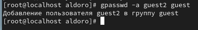
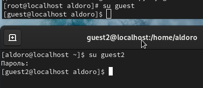
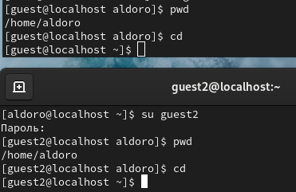
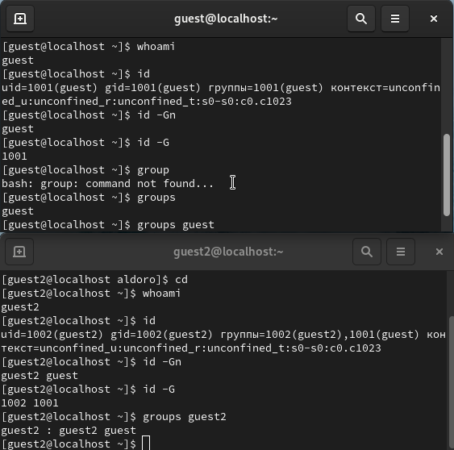
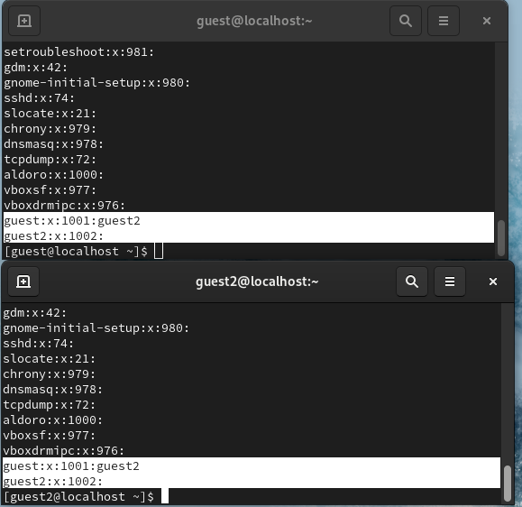
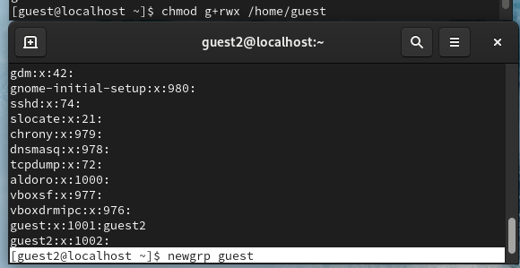
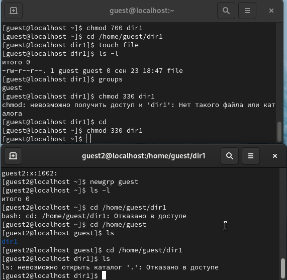

---
## Front matter
title: "Лабораторная работа №3"
subtitle: "Информационная безопасность"
author: "Дорофеева Алёна Тимофеевна"

## Generic otions
lang: ru-RU
toc-title: "Содержание"

## Bibliography
bibliography: bib/cite.bib
csl: pandoc/csl/gost-r-7-0-5-2008-numeric.csl

## Pdf output format
toc: true # Table of contents
toc-depth: 2
lof: true # List of figures
lot: true # List of tables
fontsize: 12pt
linestretch: 1.5
papersize: a4
documentclass: scrreprt
## I18n polyglossia
polyglossia-lang:
  name: russian
  options:
	- spelling=modern
	- babelshorthands=true
polyglossia-otherlangs:
  name: english
## I18n babel
babel-lang: russian
babel-otherlangs: english
## Fonts
mainfont: PT Serif
romanfont: PT Serif
sansfont: PT Sans
monofont: PT Mono
mainfontoptions: Ligatures=TeX
romanfontoptions: Ligatures=TeX
sansfontoptions: Ligatures=TeX,Scale=MatchLowercase
monofontoptions: Scale=MatchLowercase,Scale=0.9
## Biblatex
biblatex: true
biblio-style: "gost-numeric"
biblatexoptions:
  - parentracker=true
  - backend=biber
  - hyperref=auto
  - language=auto
  - autolang=other*
  - citestyle=gost-numeric
## Pandoc-crossref LaTeX customization
figureTitle: "Рис."
tableTitle: "Таблица"
listingTitle: "Листинг"
lofTitle: "Список иллюстраций"
lotTitle: "Список таблиц"
lolTitle: "Листинги"
## Misc options
indent: true
header-includes:
  - \usepackage{indentfirst}
  - \usepackage{float} # keep figures where there are in the text
  - \floatplacement{figure}{H} # keep figures where there are in the text
---

# Цель работы

Получение практических навыков работы в консоли с атрибутами файлов для групп пользователей.

# Задание

1. Произвести работу в консоли с атрибутами от имени пользователя guest;
2. Сотавить опытным путем от пользователя guest2 таблицы "Установленные права и разрешенные действия" и "Минимальные права для совершения операций".


# Выполнение лабораторной работы

1. В установленной операционной системе создайте учётную запись пользователя guest (использую учётную запись администратора):
useradd guest
2. Задайте пароль для пользователя guest (использую учётную запись администратора):
passwd guest

Так как в предыдущей лабораторной работе мы уже создали пользователя guest, создадим сразу guest 2.

3. Аналогично создайте второго пользователя guest2. (рис. @fig:001)

{#fig:001 width=70%}

4. Добавьте пользователя guest2 в группу guest:
gpasswd -a guest2 guest (рис. @fig:001)

{#fig:001 width=70%}

5. Осуществите вход в систему от двух пользователей на двух разных консолях: guest на первой консоли и guest2 на второй консоли.(рис. @fig:001)

{#fig:001 width=70%}

6. Для обоих пользователей командой pwd определите директорию, в которой вы находитесь. Сравните её с приглашениями командной строки.
(рис. @fig:001)

{#fig:001 width=70%}

Командой cd мы убедились, что находимся в домашней директрии. 

7. Уточните имя вашего пользователя, его группу, кто входит в неё
и к каким группам принадлежит он сам. Определите командами
groups guest и groups guest2, в какие группы входят пользователи guest и guest2. Сравните вывод команды groups с выводом команд
id -Gn и id -G.(рис. @fig:001)

{#fig:001 width=70%}

Видим следующие данные: uid = 1001(guest), gid = 1001(guest), groups = 1001(guest) - для guest; uid = 1002(guest2), gid = 1002(guest2), groups = 1002(guest2),1001(guest) - для guest2.

Также рассматрим команды 
id -Gn - показывает названия групп пользователя, 
id -G - id групп пользователя.

8. Сравните полученную информацию с содержимым файла /etc/group.
Просмотрите файл командой
cat /etc/group (рис. @fig:001)

{#fig:001 width=70%}

9. От имени пользователя guest2 выполните регистрацию пользователя
guest2 в группе guest командой
newgrp guest (рис. @fig:001)

{#fig:001 width=70%}

10. От имени пользователя guest измените права директории /home/guest,
разрешив все действия для пользователей группы:
chmod g+rwx /home/guest
(рис. @fig:001)

{#fig:001 width=70%}

11. От имени пользователя guest снимите с директории /home/guest/dir1
все атрибуты командой chmod 000 dirl и проверьте правильность снятия атрибутов. (рис. @fig:001)

{#fig:001 width=70%}

Меняя атрибуты у директории dir1 и файла file1 от имени пользователя guest и делая проверку от пользователя guest2, заполнила табл. 1,
определив опытным путём, какие операции разрешены, а какие нет. Если операция разрешена, занесила в таблицу знак «+», если не разрешена,
знак «-».
Сравнила табл. 2 (из лабораторной работы № 2) и табл. 2.
На основании заполненной таблицы определите те или иные минимально необходимые права для выполнения пользователем guest2 операций
внутри директории dir1 и заполните табл. 3.2.

Таблица 1. Установленные права и разрешённые действия для групп
|Права директории|Права файла|Создание файла|Удаление файла|Запись в файл|Чтение файла|Смена директории|Просмотр файлов директории|Переименование файла|Смена аттрибутов файла|
|------------------|-------------|-------|-----|------|-------|------------|-----------|---------|------------|
|```---------``` (000)|```---------``` (000)| - | - | - | - | - | - | - | - |
|```---------``` (000)|```-----x---``` (010)| - | - | - | - | - | - | - | - |
|```---------``` (000)|```----w----``` (020)| - | - | - | - | - | - | - | - |
|```---------``` (000)|```----wx---``` (030)| - | - | - | - | - | - | - | - |
|```---------``` (000)|```---r-----``` (040)| - | - | - | - | - | - | - | - |
|```---------``` (000)|```---r-x---``` (050)| - | - | - | - | - | - | - | - |
|```---------``` (000)|```---rw----``` (060)| - | - | - | - | - | - | - | - |
|```---------``` (000)|```---rwx---``` (070)| - | - | - | - | - | - | - | - |
|```-----x---``` (010)|```---------``` (000)| - | - | - | - | + | - | - | - |
|```-----x---``` (010)|```-----x---``` (010)| - | - | - | - | + | - | - | - |
|```-----x---``` (010)|```----w----``` (020)| - | - | + | - | + | - | - | - |
|```-----x---``` (010)|```----wx---``` (030)| - | - | + | - | + | - | - | - |
|```-----x---``` (010)|```---r-----``` (040)| - | - | - | + | + | - | - | + |
|```-----x---``` (010)|```---r-x---``` (050)| - | - | - | + | + | - | - | + |
|```-----x---``` (010)|```---rw----``` (060)| - | - | + | + | + | - | - | + |
|```-----x---``` (010)|```---rwx---``` (070)| - | - | + | + | + | - | - | + |
|```----w----``` (020)|```---------``` (000)| - | - | - | - | - | - | - | - |
|```----w----``` (020)|```-----x---``` (010)| - | - | - | - | - | - | - | - |
|```----w----``` (020)|```----w----``` (020)| - | - | - | - | - | - | - | - |
|```----w----``` (020)|```----wx---``` (030)| - | - | - | - | - | - | - | - |
|```----w----``` (020)|```---r-----``` (040)| - | - | - | - | - | - | - | - |
|```----w----``` (020)|```---r-x---``` (050)| - | - | - | - | - | - | - | - |
|```----w----``` (020)|```---rw----``` (060)| - | - | - | - | - | - | - | - |
|```----w----``` (020)|```---rwx---``` (070)| - | - | - | - | - | - | - | - |
|```----wx---``` (030)|```---------``` (000)| + | + | - | - | + | - | + | - |
|```----wx---``` (030)|```-----x---``` (010)| + | + | - | - | + | - | + | - |
|```----wx---``` (030)|```----w----``` (020)| + | + | + | - | + | - | + | - |
|```----wx---``` (030)|```----wx---``` (030)| + | + | + | - | + | - | + | - |
|```----wx---``` (030)|```---r-----``` (040)| + | + | - | + | + | - | + | + |
|```----wx---``` (030)|```---r-x---``` (050)| + | + | - | + | + | - | + | + |
|```----wx---``` (030)|```---rw----``` (060)| + | + | + | + | + | - | + | + |
|```----wx---``` (030)|```---rwx---``` (070)| + | + | + | + | + | - | + | + |
|```---r-----``` (040)|```---------``` (000)| - | - | - | - | - | + | - | - |
|```---r-----``` (040)|```-----x---``` (010)| - | - | - | - | - | + | - | - |
|```---r-----``` (040)|```----w----``` (020)| - | - | - | - | - | + | - | - |
|```---r-----``` (040)|```----wx---``` (030)| - | - | - | - | - | + | - | - |
|```---r-----``` (040)|```---r-----``` (040)| - | - | - | - | - | + | - | - |
|```---r-----``` (040)|```---r-x---``` (050)| - | - | - | - | - | + | - | - |
|```---r-----``` (040)|```---rw----``` (060)| - | - | - | - | - | + | - | - |
|```---r-----``` (040)|```---rwx---``` (070)| - | - | - | - | - | + | - | - |
|```---r-x---``` (050)|```---------``` (000)| - | - | - | - | + | + | - | - |
|```---r-x---``` (050)|```-----x---``` (010)| - | - | - | - | + | + | - | - |
|```---r-x---``` (050)|```----w----``` (020)| - | - | + | - | + | + | - | - |
|```---r-x---``` (050)|```----wx---``` (030)| - | - | + | - | + | + | - | - |
|```---r-x---``` (050)|```---r-----``` (040)| - | - | - | + | + | + | - | + |
|```---r-x---``` (050)|```---r-x---``` (050)| - | - | - | + | + | + | - | + |
|```---r-x---``` (050)|```---rw----``` (060)| - | - | + | + | + | + | - | + |
|```---r-x---``` (050)|```---rwx---``` (070)| - | - | + | + | + | + | - | + |
|```---rw----``` (060)|```---------``` (000)| - | - | - | - | - | + | - | - |
|```---rw----``` (060)|```-----x---``` (010)| - | - | - | - | - | + | - | - |
|```---rw----``` (060)|```----w----``` (020)| - | - | - | - | - | + | - | - |
|```---rw----``` (060)|```----wx---``` (030)| - | - | - | - | - | + | - | - |
|```---rw----``` (060)|```---r-----``` (040)| - | - | - | - | - | + | - | - |
|```---rw----``` (060)|```---r-x---``` (050)| - | - | - | - | - | + | - | - |
|```---rw----``` (060)|```---rw----``` (060)| - | - | - | - | - | + | - | - |
|```---rw----``` (060)|```---rwx---``` (070)| - | - | - | - | - | + | - | - |
|```---rwx---``` (070)|```---------``` (000)| + | + | - | - | + | + | + | - |
|```---rwx---``` (070)|```-----x---``` (010)| + | + | - | - | + | + | + | - |
|```---rwx---``` (070)|```----w----``` (020)| + | + | + | - | + | + | + | - |
|```---rwx---``` (070)|```----wx---``` (030)| + | + | + | - | + | + | + | - |
|```---rwx---``` (070)|```---r-----``` (040)| + | + | - | + | + | + | + | + |
|```---rwx---``` (070)|```---r-x---``` (050)| + | + | - | + | + | + | + | + |
|```---rwx---``` (070)|```---rw----``` (060)| + | + | + | + | + | + | + | + |
|```---rwx---``` (070)|```---rwx---``` (070)| + | + | + | + | + | + | + | + |

Таблица 2. Минимальные права для совершения операций от имени пользователей
входящих в группу

|Операция                |Минимальные права на директорию|Минимальные права на файл|
|------------------------|-------------------------------|-------------------------|
|Создание файла          |`d----wx---(030)`              |`----------(000)`        |
|Удаление файла          |`d----wx---(030)`              |`----------(000)`        |
|Чтение файла            |`d-----x---(010)`              |`----r-----(040)`        |
|Запись в файл           |`d-----x---(010)`              |`-----w----(020)`        |
|Переименование файла    |`d----wx---(030)`              |`----------(000)`        |
|Создание поддиректории  |`d----wx---(030)`              |`----------(000)`        |
|Удаление поддиректории  |`d----wx---(030)`              |`----------(000)`        |

# Выводы

Получила практические навыки работы в консоли с атрибутами файлов для групп пользователей.

# Список литературы{.unnumbered}

::: {#refs}
:::
