---
## Front matter
title: "Лабораторная работа №4"
subtitle: "Информационная безопасность"
author: "Дорофеева Алёна Тимофеевна"

## Generic otions
lang: ru-RU
toc-title: "Содержание"

## Bibliography
bibliography: bib/cite.bib
csl: pandoc/csl/gost-r-7-0-5-2008-numeric.csl

## Pdf output format
toc: true # Table of contents
toc-depth: 2
lof: true # List of figures
lot: true # List of tables
fontsize: 12pt
linestretch: 1.5
papersize: a4
documentclass: scrreprt
## I18n polyglossia
polyglossia-lang:
  name: russian
  options:
	- spelling=modern
	- babelshorthands=true
polyglossia-otherlangs:
  name: english
## I18n babel
babel-lang: russian
babel-otherlangs: english
## Fonts
mainfont: PT Serif
romanfont: PT Serif
sansfont: PT Sans
monofont: PT Mono
mainfontoptions: Ligatures=TeX
romanfontoptions: Ligatures=TeX
sansfontoptions: Ligatures=TeX,Scale=MatchLowercase
monofontoptions: Scale=MatchLowercase,Scale=0.9
## Biblatex
biblatex: true
biblio-style: "gost-numeric"
biblatexoptions:
  - parentracker=true
  - backend=biber
  - hyperref=auto
  - language=auto
  - autolang=other*
  - citestyle=gost-numeric
## Pandoc-crossref LaTeX customization
figureTitle: "Рис."
tableTitle: "Таблица"
listingTitle: "Листинг"
lofTitle: "Список иллюстраций"
lotTitle: "Список таблиц"
lolTitle: "Листинги"
## Misc options
indent: true
header-includes:
  - \usepackage{indentfirst}
  - \usepackage{float} # keep figures where there are in the text
  - \floatplacement{figure}{H} # keep figures where there are in the text
---

# Цель работы

Получение практических навыков работы в консоли с расширенными атрибутами файлов.

# Задание

- Изучить на практике действие расширенных атрибутов «а» и «i».

# Выполнение лабораторной работы

1. От имени пользователя guest определите расширенные атрибуты файла `/home/guest/dir1/file1` командой `lsattr /home/guest/dir1/file1` (рис. @fig:1).

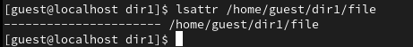{#fig:1 width=70%}

2. Установите командой `chmod 600 file1` на файл **file1** права, разрешающие чтение и запись для владельца файла (рис. @fig:2).

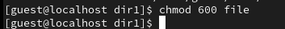{#fig:2 width=70%}

3. Попробуйте установить на файл **/home/guest/dir1/file1** расширенный атрибут a от имени пользователя **guest** (рис. @fig:3):

```
chattr +a /home/guest/dir1/file1
```

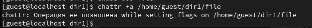{#fig:3 width=70%}

В ответ мы получили отказ от выполнения операции.

4. Зайдем в консоль с правами администратора (рис. @fig:04). Попробуйте установить расширенный атрибут a на файл `/home/guest/dir1/file1` от имени суперпользователя (рис. @fig:4):

```
chattr +a /home/guest/dir1/file1
```

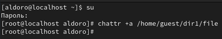{#fig:4 width=70%}

Установка разрешена.

5. От пользователя **guest** проверьте правильность установления атрибута: `lsattr /home/guest/dir1/file1` (рис. @fig:5)

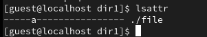{#fig:05 width=70%}

6. Попробуйте удалить файл **file1** `rm file1` либо стереть имеющуюся в нём информацию командой `echo "abcd" > /home/guest/dirl/file1` (рис. @fig:6).
Попробуйте переименовать файл `mv file1 file` (рис. @fig:6).

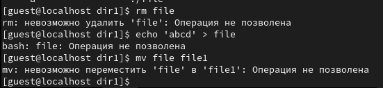{#fig:6 width=70%}

Видим, что мы не мможем сделать ничего из вышеперечисленного, поскольку атрибут не позволяет нам изменять имеющуюся информацию о файле.

8. Попробуйте с помощью команды `chmod 000 file1` установить на файл **file1** права, запрещающие чтение, выполнение и запись для владельца файла (рис. @fig:7). Удалось ли вам успешно выполнить указанные команды?

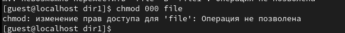{#fig:7 width=70%}

Мы не можем поменять разрешения файла с данным атрибутом.

9. Снимите расширенный атрибут `a` с файла **/home/guest/dirl/file1** от имени суперпользователя командой `chattr -a /home/guest/dir1/file1` (рис. @fig:8). После этого выполним опрации, неудавшиеся ранее (рис. @fig:9).

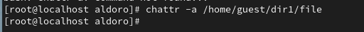{#fig:09 width=70%}

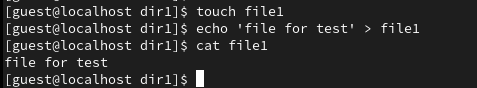{#fig:9 width=70%}

Видим, что теперь мы можем произвести дозапись, запись, переименование и удаление файла.

Разрешения файла поменять возможно.

10. Повторите ваши действия по шагам, заменив атрибут «a» атрибутом «i».
Удалось ли вам дозаписать информацию в файл? Ваши наблюдения занесите в отчёт.
В результате выполнения работы вы повысили свои навыки использования интерфейса командой строки (CLI), познакомились на примерах с тем,
как используются основные и расширенные атрибуты при разграничении
доступа. Имели возможность связать теорию дискреционного разделения
доступа (дискреционная политика безопасности) с её реализацией на практике в ОС Linux. Составили наглядные таблицы, поясняющие какие операции возможны при тех или иных установленных правах. Опробовали действие на практике расширенных атрибутов «а» и «i».

Для этого сперва создадим файл, удаленный ранее - **file**, и запишем в него какую-то информацию, для проверки (рис. @fig:10).

{#fig:10 width=70%}

После этого присвоим файлу расширенный атрибут **i**, который делает файл полностью неизменяемым (рис. @fig:11).

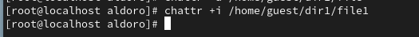{#fig:11 width=70%}

Заново проделаем вышеперечисленные команды (рис. @fig:12). 

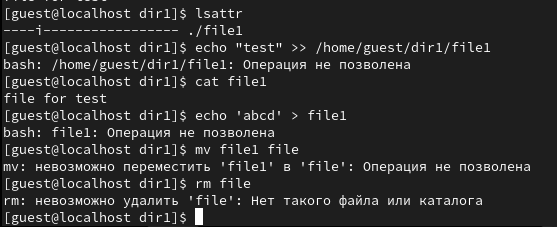{#fig:13 width=70%}

Видим, что мы не можем произвести ни одно из выполненных действий, а именно: дозапись в файл, запись в файл, изменение имени файла, удаление.

Удалим атрибут **i** из списка расширенных атрибутов файла (рис. @fig:13).

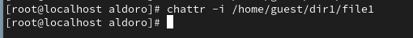{#fig:14 width=70%}

И снова прделаем операции (рис. @fig:14).

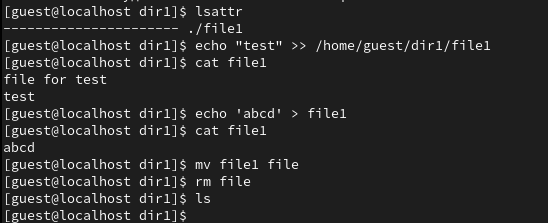{#fig:15 width=70%}

Видим, что теперь мы можем успешно осуществить все команды, которые не удалоаь осуществить ранее.

# Выводы

В результате выполнения работы повысила свои навыки использования интерфейса командой строки (CLI), познакомились на примерах с тем,
как используются расширенные атрибуты. Опробовала действие на практике расширенных атрибутов «а» и «i».


# Список литературы{.unnumbered}

::: {#refs}
:::
