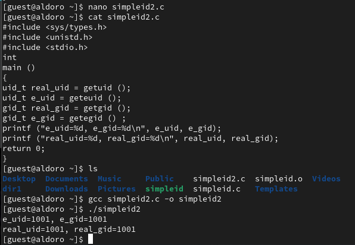
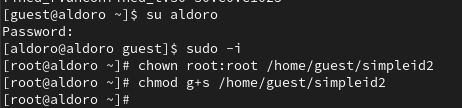
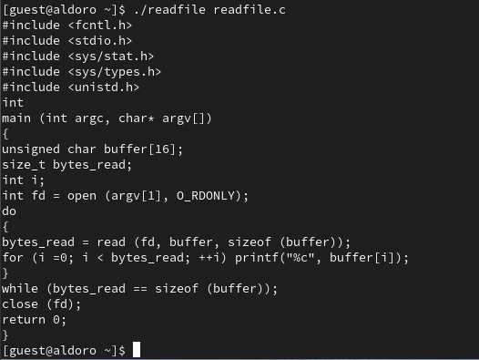

---
## Front matter
title: "Лабораторная работа №5"
subtitle: "Дисциплина: Информационная безопасность"
author: "Дорофеева Алёна Тимофеевна"

## Generic otions
lang: ru-RU
toc-title: "Содержание"

## Bibliography
bibliography: bib/cite.bib
csl: pandoc/csl/gost-r-7-0-5-2008-numeric.csl

## Pdf output format
toc: true # Table of contents
toc-depth: 2
lof: true # List of figures
lot: true # List of tables
fontsize: 12pt
linestretch: 1.5
papersize: a4
documentclass: scrreprt
## I18n polyglossia
polyglossia-lang:
  name: russian
  options:
	- spelling=modern
	- babelshorthands=true
polyglossia-otherlangs:
  name: english
## I18n babel
babel-lang: russian
babel-otherlangs: english
## Fonts
mainfont: PT Serif
romanfont: PT Serif
sansfont: PT Sans
monofont: PT Mono
mainfontoptions: Ligatures=TeX
romanfontoptions: Ligatures=TeX
sansfontoptions: Ligatures=TeX,Scale=MatchLowercase
monofontoptions: Scale=MatchLowercase,Scale=0.9
## Biblatex
biblatex: true
biblio-style: "gost-numeric"
biblatexoptions:
  - parentracker=true
  - backend=biber
  - hyperref=auto
  - language=auto
  - autolang=other*
  - citestyle=gost-numeric
## Pandoc-crossref LaTeX customization
figureTitle: "Рис."
tableTitle: "Таблица"
listingTitle: "Листинг"
lofTitle: "Список иллюстраций"
lotTitle: "Список таблиц"
lolTitle: "Листинги"
## Misc options
indent: true
header-includes:
  - \usepackage{indentfirst}
  - \usepackage{float} # keep figures where there are in the text
  - \floatplacement{figure}{H} # keep figures where there are in the text
---

# Цель работы

Изучение механизмов изменения идентификаторов, применения SetUID- и Sticky-битов. Получение практических навыков работы в консоли с дополнительными атрибутами. Рассмотрение работы механизма смены идентификатора процессов пользователей, а также влияние бита Sticky на запись и удаление файлов.

# Задание

- Изучить на практике применение SetUID- и Sticky-битов.

# Теоретическое введение

**Setuid** – это бит разрешения, который позволяет пользователю запускать исполняемый файл с правами владельца этого файла. Другими словами, использование этого бита позволяет нам поднять привилегии пользователя в случае, если это необходимо. Классический пример использования этого бита в операционной системе это команда sudo.

Там, где обычно установлен классический бит **x** (на исполнение), выставляется специальный бит **s**. Это позволяет обычному пользователю системы выполнять команды с повышенными привилегиями без необходимости входа в систему как root, разумеется зная пароль пользователя root. Принцип работы **Setgid** очень похож на setuid с отличием, что файл будет запускаться пользователем от имени группы, которая владеет файлом.

Биты **setuid** и **setgid** выставляются с помощью команд `chmod u+s` и `chmod g+s` соответственно.[@01]

**Sticky-bit** — дополнительный атрибут файлов или каталогов в операционных системах семейства UNIX. В настоящее время sticky bit используется в основном для каталогов, чтобы защитить в них файлы. Из такого каталога пользователь может удалить только те файлы, владельцем которых он является. Примером может служить каталог /tmp, в который запись открыта для всех пользователей, но нежелательно удаление чужих файлов. Установка атрибута производится утилитой chmod.

В операционной системе Solaris для файлов, не являющихся программами, имеет строго противоположное действие — запрещает сохранение данных этого файла в системном кэше.[@02]

Это разрешение полезно для защиты файлов от случайного удаления в среде, где несколько пользователей имеют права на запись в один и тот же каталог. Если применяется закрепленный sticky bit, пользователь может удалить файл, только если он является пользователем-владельцем файла или каталога, в котором содержится файл. По этой причине он применяется в качестве разрешения по умолчанию для каталога /tmp и может быть полезен также для каталогов общих групп.

Когда вы применяете sticky bit, пользователь может удалять файлы, только если выполняется одно из следующих условий:

- Пользователь является владельцем файла;
- Пользователь является владельцем каталога, в котором находится файл.[@03]

# Выполнение лабораторной работы

1. Вошла в систему от имени пользователя guest (рис. @fig:1). Убедилась, что в системе установлен компилятор gcc, проверив версию командой ```gcc -v``` (рис. @fig:1). Видим, что он установлен. Отключила систему запретов до очередной перезагрузки командой ```setenforce 0``` (рис. @fig:1). После этого команда ```getenforce``` выводит "Permissive" (рис. @fig:1).

{#fig:001 width=70%}

2. Создала программу simpleid.c в текстовом редакторе nano (рис. @fig:2). 

{#fig:2 width=70%}

3. Cкомпилировала программу и убедилась, что файл программы создан, командой ```gcc simpleid.c -o simpleid``` (рис. @fig:3). 

4. Выполнила программу simpleid, введя ```./simpleid``` (рис. @fig:3).

5. Выполнила системную программу id (рис. @fig:3). Видим, что выводимая информация о uid и gid идентична, но команда ```id``` также выводит groups=1001(guest).

{#fig:3 width=70%}

6. Усложнила программу, добавив вывод действительных идентификаторов (рис. @fig:4). Получившуюся программу назвала simpleid2.c (рис. @fig:4). 

{#fig:4 width=70%}

7. Cкомпилировала программу командой ```gcc simpleid2.c -o simpleid2``` (рис. @fig:6). Запустила программу, введя ```./simpleid2``` (рис. @fig:6).

{#fig:003 width=70%}

8. Выполнила команды ```sudo chown root:guest /home/guest/simpleid2``` и ```sudo chmod u+s /home/guest/simpleid2``` (рис. @fig:004).

9. Первая команда меняет у файла владельца и группу. Вторая команда ставит SetUID-бит.

10. Выполнила проверку правильности установки новых атрибутов и смены владельца файла simpleid2 с помощью команды ```ls -l simpleid2``` (рис. @fig:004). Видим, что все установлено верно.

11. Запустила файл simpleid2 командой ```./simpleid2``` (рис. @fig:004). Также выполнила системную команду ```id``` (рис. @fig:004). Видим, что файл выводит информацию не только о реальном идентификаторе, но и эффективных ID - EUID и EGID. Фактические ID пользователя и группы соответствуютт ID пользователя, который вызвал процесс (пользователь guest, группа guest). Эффективный ID пользователя соответствует установленному SetUid биту на исполняемом файле (привелегии суперпользователя). Эффективный ID группы соответствует установленному SetGid биту на исполняемом файле.Команда ```id``` выводит информацию только о реальном идентификаторе.

12. Проделала то же самое относительно SetGID-бита (рис. @fig:004). Видим, что теперь при исполнении файла выводится EUID = 1001, EGID = 0, так как мы установили SetGid бит.

{#fig:004 width=70%}

13. Создала программу readfile с помощью тектового редактора nano (рис. @fig:005).

14. Откомпилировала её командой ```gcc readfile.c -o readfile``` (рис. @fig:005).

{#fig:005 width=70%}

15. Сменила владельца у файла readfile.c на root командой ```sudo chown root /home/guest/readfile``` и изменила права так, чтобы только суперпользователь
(в моем случае владелец) мог прочитать его, a guest (член группы) не мог командой ```sudo chmod 733 /home/guest/readfile``` (рис. @fig:006).

16. Проверила, что пользователь guest не может прочитать файл readfile.c командой ```cat readfile.c``` (рис. @fig:006). Видим, что нам действильно отказано в доступе. 

17. Сменила у программы readfile владельца обратно на guest и установила SetUID-бит командами ```sudo chown guest:guest /home/guest/readfile``` и ```sudo chmod u+s /home/guest/readfile``` (рис. @fig:006). 

{#fig:006 width=70%}

18. Проверила, может ли программа readfile прочитать файл readfile.c (рис. @fig:007). Видим, что может, так как мы установили SetUID-бит.

{#fig:007 width=70%}

19. Проверилп, может ли программа readfile прочитать файл /etc/shadow (рис. @fig:008). Видим, что может, так как мы установили SetUID-бит.

{#fig:008 width=70%}

## Исследование Sticky-бита

1. Выяснила, установлен ли атрибут Sticky на директории /tmp, для чего выполнила команду
```ls -l / | grep tmp``` (рис. @fig:009). Видим, что он установлен (буква t в конце). 

2. От имени пользователя guest создала файл file01.txt в директории /tmp со словом test командой ```echo "test" > /tmp/file01.txt``` (рис. @fig:009). 

3. Просмотрела атрибуты у только что созданного файла (```команда  ls -l /tmp/file01.txt```) и разрешила чтение и запись для категории пользователей «все остальные» командой ```chmod o+rw /tmp/file01.txt``` (рис. @fig:009). Проверила атрибуты (```команда  ls -l /tmp/file01.txt```) (рис. @fig:009).

{#fig:009 width=70%}

4. От пользователя guest2 (не являющегося владельцем) попробовала прочитать файл /tmp/file01.txt командой ```cat /tmp/file01.txt``` (рис. @fig:010). Прочитать файл удалось. 

5. От пользователя guest2 попробовала дозаписать в файл
/tmp/file01.txt слово test2 командой ```echo "test2" >> /tmp/file01.txt``` (рис. @fig:010). Выполнить данную операцию не удалось.

6. Проверила содержимое файла командой ```cat /tmp/file01.txt``` (рис. @fig:010). Действие по сути бессмысленное, так как файл не менялся. 

7. От пользователя guest2 попробовала записать в файл /tmp/file01.txt
слово test3, стерев при этом всю имеющуюся в файле информацию командой
```echo "test3" > /tmp/file01.txt``` (рис. @fig:010). Выполнить эту операцию не удалось.

8. Проверила содержимое файла командой ```cat /tmp/file01.txt``` (рис. @fig:010). Действие по сути бессмысленное, так как файл не менялся. 

9. От пользователя guest2 попробовала удалить файл /tmp/file01.txt командой
```rm /tmp/fileOl.txt``` (рис. @fig:010). 

{#fig:010 width=70%}

10. Повысила свои права до суперпользователя следующей командой ```su -```
и выполнида после этого команду ```chmod -t /tmp```, снимающую атрибут t (Sticky-бит) с
директории /tmp (рис. @fig:011).

11. Покинула режим суперпользователя командой
```exit``` (рис. @fig:011)

{#fig:011 width=70%}

12. От пользователя guest2 проверила, что атрибута t у директории /tmp нет командой ```ls -l / | grep tmp``` (рис. @fig:012).

13. Повторила предыдущие шаги (рис. @fig:012). Теперь мы смогли удалить файл.

14. Нам удалось удалить файл, когда мы сняли Sticky-бит. 

{#fig:012 width=70%}


# Выводы

Изучила механизмы изменения идентификаторов, применения SetUID- и Sticky-битов. Получила практические навыки работы в консоли с дополнительными атрибутами. Рассмотрела работы механизма смены идентификатора процессов пользователей, а также влияние бита Sticky на запись и удаление файлов.

# Список литературы{.unnumbered}

::: {#refs}
:::