---
## Front matter
lang: ru-RU
title: Лабораторная работа №6
subtitle: Мандатное разграничение прав в Linux

author:
  - Дорофеева А.Т.
institute:
  - Российский университет дружбы народов, Москва, Россия
date: 12 октября 2023

## i18n babel
babel-lang: russian
babel-otherlangs: english

## Formatting pdf
toc: false
toc-title: Содержание
slide_level: 2
aspectratio: 169
section-titles: true
theme: metropolis
header-includes:
 - \metroset{progressbar=frametitle,sectionpage=progressbar,numbering=fraction}
 - '\makeatletter'
 - '\beamer@ignorenonframefalse'
 - '\makeatother'
---

# Информация

## Докладчик

  * Дорофеева Алёна Тимофеевна
  * студент(-ка) уч. группы НПИбд-01-20
  * Российский университет дружбы народов
  * [1032201392@pfur.ru](mailto:1032201392@rudn.ru)
  * <https://github.com/DorofeevaAT>

# Вводная часть

## Актуальность

- Необходимость понимания возможножностей технологии SELinux и веб-сервера Apache.

## Объект и предмет исследования

- SELinux, Apache

## Цели и задачи

- Получить первое практическое знакомство с технологией SELinux1
- Проверить работу SELinx на практике совместно с веб-сервером Apache

## Материалы и методы

- Командная строка ОС Linux

# Процесс выполнения работы

## Режим enforcing политики targeted и запуск

:::::::::::::: {.columns align=center}
::: {.column width="50%"}

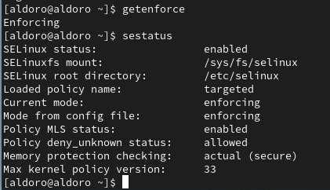{}

:::
::: {.column width="50%"}

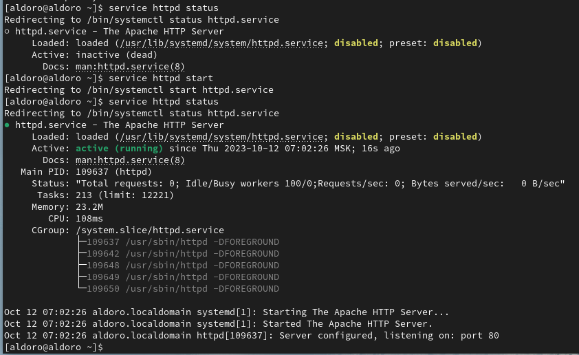
:::
::::::::::::::

## Статистика Apache

:::::::::::::: {.columns align=center}
::: {.column width="50%"}

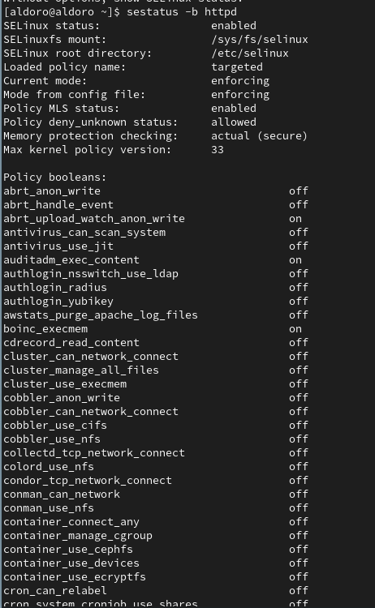

:::
::: {.column width="50%"}

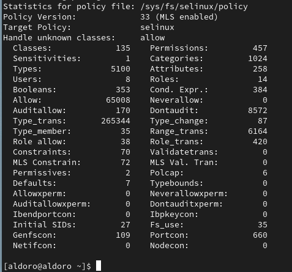

:::
::::::::::::::

## Создание файла test.html

:::::::::::::: {.columns align=center}
::: {.column width="50%"}

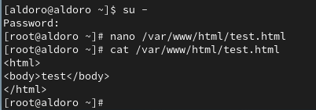

:::
::: {.column width="50%"}

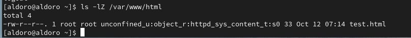

:::
::::::::::::::

## Обращение к файлу через веб-сервер

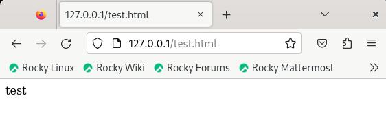{width=80%}

## Смена контекста безропасности html файла

:::::::::::::: {.columns align=center}
::: {.column width="50%"}

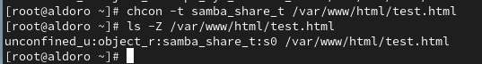

:::
::: {.column width="50%"}

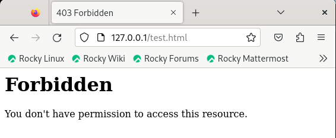

:::
::::::::::::::

## Log-файлы

:::::::::::::: {.columns align=center}
::: {.column width="50%"}

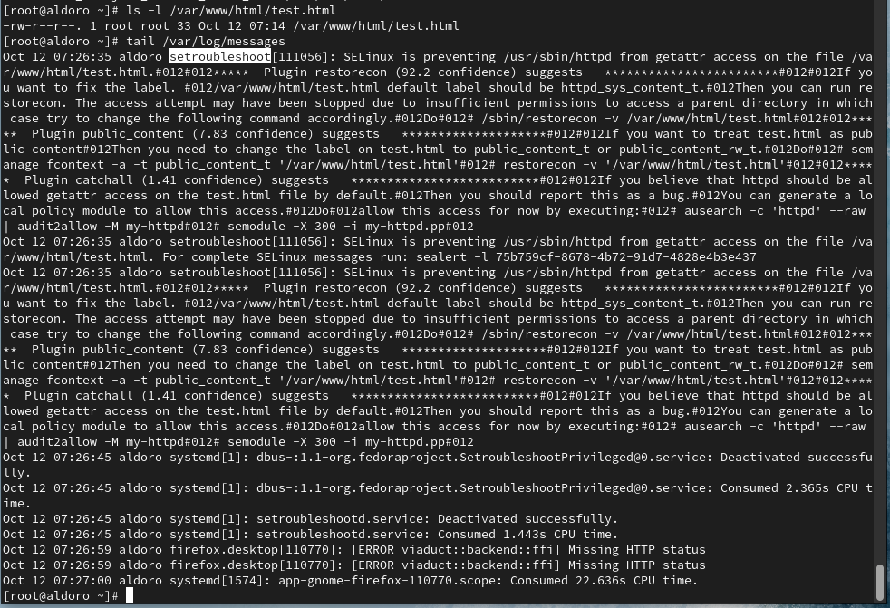

## Смена прослушиваемого порта и перезапуск сервера

:::::::::::::: {.columns align=center}
::: {.column width="50%"}

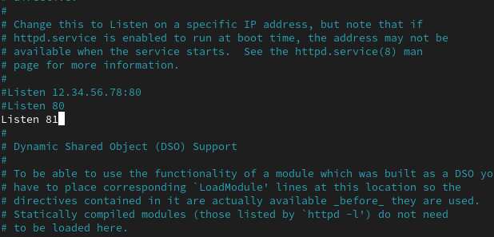

:::
::: {.column width="50%"}

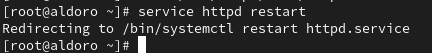

:::
::::::::::::::

## log-файл

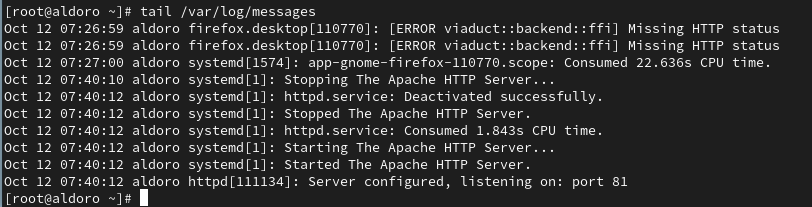{width=80%}

## Список портов

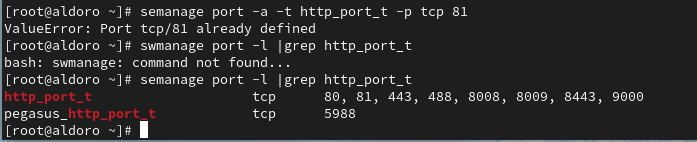{width=80%}

## Возвращаем контекст безопасности

:::::::::::::: {.columns align=center}
::: {.column width="50%"}

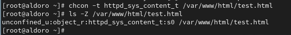

:::
::: {.column width="50%"}

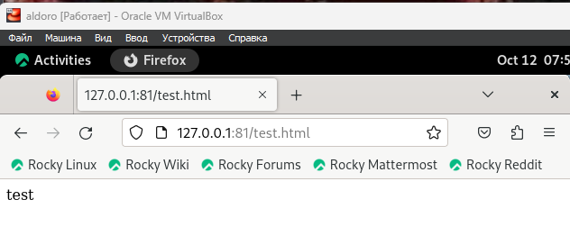

# Результаты работы

- Получила первое практическое знакомство с технологией SELinux1
- Проверила работу SELinx на практике совместно с веб-сервером Apache.

# Вывод

Развила навыки администрирования ОС Linux. Получила первое практическое знакомство с технологией SELinux1. Проверила работу SELinx на практике совместно с веб-сервером Apache.

[def]: https://github.com/DorofeevaAT