---
## Front matter
title: "Лабораторная работа №6"
subtitle: "Дисциплина: Информационная безопасность"
author: "Дорофеева Алёна Тимофеевна"

## Generic otions
lang: ru-RU
toc-title: "Содержание"

## Bibliography
bibliography: bib/cite.bib
csl: pandoc/csl/gost-r-7-0-5-2008-numeric.csl

## Pdf output format
toc: true # Table of contents
toc-depth: 2
lof: true # List of figures
lot: true # List of tables
fontsize: 12pt
linestretch: 1.5
papersize: a4
documentclass: scrreprt
## I18n polyglossia
polyglossia-lang:
  name: russian
  options:
	- spelling=modern
	- babelshorthands=true
polyglossia-otherlangs:
  name: english
## I18n babel
babel-lang: russian
babel-otherlangs: english
## Fonts
mainfont: PT Serif
romanfont: PT Serif
sansfont: PT Sans
monofont: PT Mono
mainfontoptions: Ligatures=TeX
romanfontoptions: Ligatures=TeX
sansfontoptions: Ligatures=TeX,Scale=MatchLowercase
monofontoptions: Scale=MatchLowercase,Scale=0.9
## Biblatex
biblatex: true
biblio-style: "gost-numeric"
biblatexoptions:
  - parentracker=true
  - backend=biber
  - hyperref=auto
  - language=auto
  - autolang=other*
  - citestyle=gost-numeric
## Pandoc-crossref LaTeX customization
figureTitle: "Рис."
tableTitle: "Таблица"
listingTitle: "Листинг"
lofTitle: "Список иллюстраций"
lotTitle: "Список таблиц"
lolTitle: "Листинги"
## Misc options
indent: true
header-includes:
  - \usepackage{indentfirst}
  - \usepackage{float} # keep figures where there are in the text
  - \floatplacement{figure}{H} # keep figures where there are in the text
---

# Цель работы

Развить навыки администрирования ОС Linux. Получить первое практическое знакомство с технологией SELinux. Проверить работу SELinx на практике совместно с веб-сервером Apache.

# Задание

- Изучить на практике работу SELinx и Apache.

# Теоретическое введение

**SELinux** (SELinux) — это система принудительного контроля доступа, реализованная на уровне ядра. Впервые эта система появилась в четвертой версии CentOS, а в 5 и 6 версии реализация была существенно дополнена и улучшена. Эти улучшения позволили SELinux стать универсальной системой, способной эффективно решать массу актуальных задач. Стоит помнить, что классическая система прав Unix применяется первой, и управление перейдет к SELinux только в том случае, если эта первичная проверка будет успешно пройдена.

Для того, чтобы понять, в чем состоит практическая ценность SELinux, рассмотрим несколько примеров, когда стандартная система контроля доступа недостаточна. Если SELinux отключен, то вам доступна только классическая дискреционная система контроля доступа, которая включает в себя DAC (избирательное управление доступом) или ACL(списки контроля доступа). То есть речь идет о манипулировании правами на запись, чтение и исполнение на уровне пользователей и групп пользователей, чего в некоторых случаях может быть совершенно недостаточно. Например:

- Администратор не может в полной мере контролировать действия пользователя. Например, пользователь вполне способен дать всем остальным пользователям права на чтение собственных конфиденциальных файлов, таких как ключи SSH.

- Процессы могут изменять настройки безопасности. Например, файлы, содержащие в себе почту пользователя должны быть доступны для чтения только одному конкретному пользователю, но почтовый клиент вполне может изменить права доступа так, что эти файлы будут доступны для чтения всем.

- Процессы наследуют права пользователя, который их запустил. Например, зараженная трояном версия браузера Firefox в состоянии читать SSH-ключи пользователя, хотя не имеет для того никаких оснований.[@01]

**Apache** – это свободное программное обеспечение для размещения веб-сервера. Он хорошо показывает себя в работе с масштабными проектами, поэтому заслуженно считается одним из самых популярных веб-серверов. Кроме того, Apache очень гибок в плане настройки, что даёт возможность реализовать все особенности размещаемого веб-ресурса.[@02]

Установить веб-сервер Apache можно слеудющим образом. Откройте окно терминала и обновите списки пакетов репозитория, введя следующее: `sudo yum update`

Теперь вы можете установить Apache с помощью команды: `sudo yum –y install httpd`

**httpd** - это имя службы Apache в CentOS. Опция –y автоматически отвечает да на запрос подтверждения.[@03]

# Выполнение лабораторной работы

## Подготовительный этап

Сперва проверим конфигурационный файл SELinux - видим, что политика targeted и режим enforcing используются в данном дистрибутиве по умолчанию, т.е. каких-то специальных настроек не требуется (рис. @fig:1).

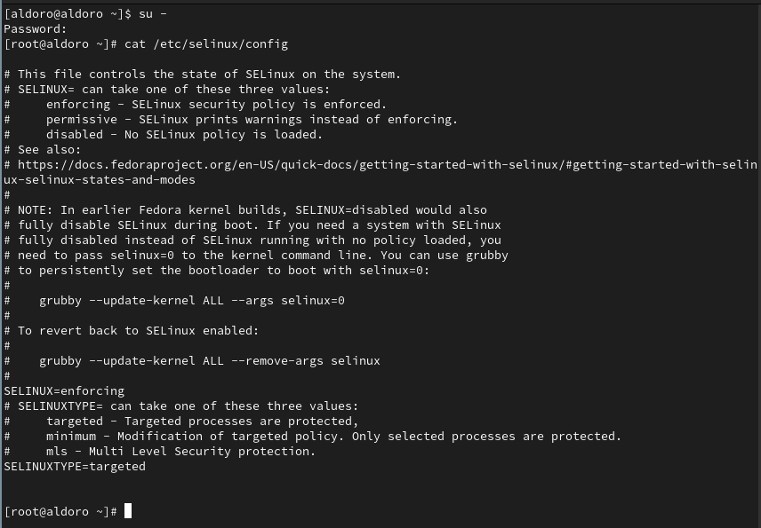{#fig:1 width=70%}

Дальше потребуется установить менеджер Apache, для этого предварительно обновим систему (рис. @fig:2), только после этого устанавливаем Apache (httpd) (рис. @fig:3).

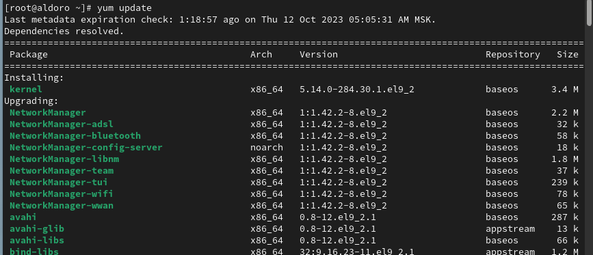{#fig:2 width=70%}

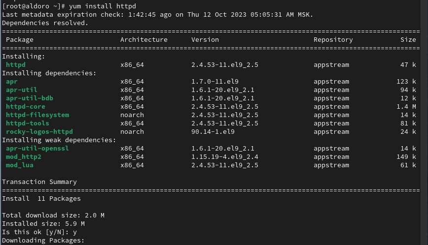{#fig:3 width=70%}

Далее зададим `ServerName test.ru` в конфигурационной файле httpd (рис. @fig:5), для этого сперва найдем, где он находится (рис. @fig:4). 

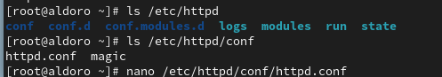{#fig:4 width=70%}

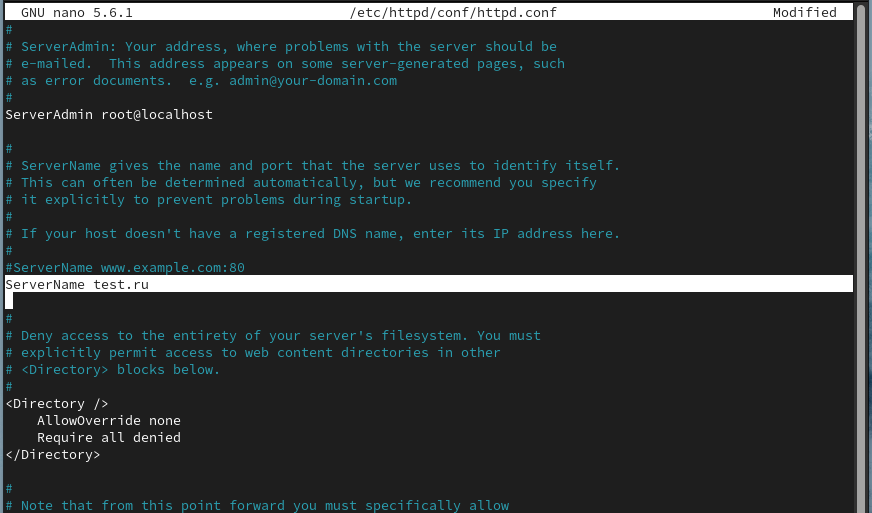{#fig:5 width=70%}

Чтобы пакетный фильтр в своей рабочей конфигурации позволял подключаться к 80-у и 81-у портам протокола tcp добавим разрешающие правила (рис. @fig:6):

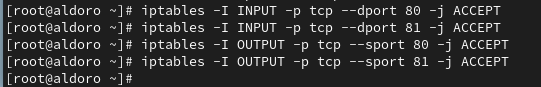{#fig:6 width=70%}

##  Порядок выполнения работы

1. Войдите в систему с полученными учётными данными и убедитесь, что
SELinux работает в режиме enforcing политики targeted с помощью команд `getenforce` и `sestatus` (рис. @fig:7).

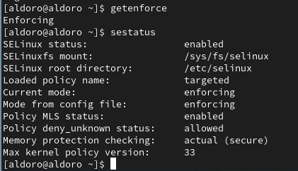{#fig:7 width=70%}

2. Обратитесь с помощью браузера к веб-серверу, запущенному на вашем
компьютере, и убедитесь, что последний работает: `service httpd status`. Видим, что он неактивен, поэтому запускаем его командой `service httpd start`, после чего снова проверяем, в этот раз серсвис активен (рис. @fig:9).

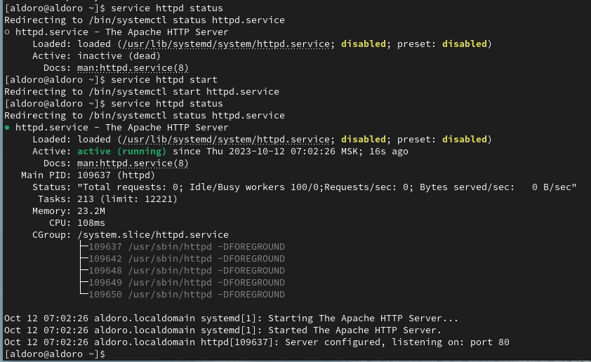{#fig:8 width=70%}

3. Найдите веб-сервер Apache в списке процессов, определите его контекст
безопасности и занесите эту информацию в отчёт. Например, можно использовать команду `ps auxZ | grep httpd` (@fig:9).

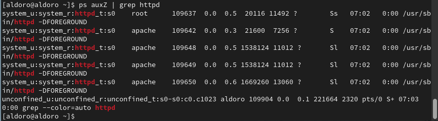{#fig:9 width=70%}

Видим, что веб-сервер имеет контекст безопасности `httpd_t`.

4. Посмотрите текущее состояние переключателей SELinux для Apache с
помощью команды `sestatus -b httpd` (рис. @fig:10). Многие из них находятся в положении «off».

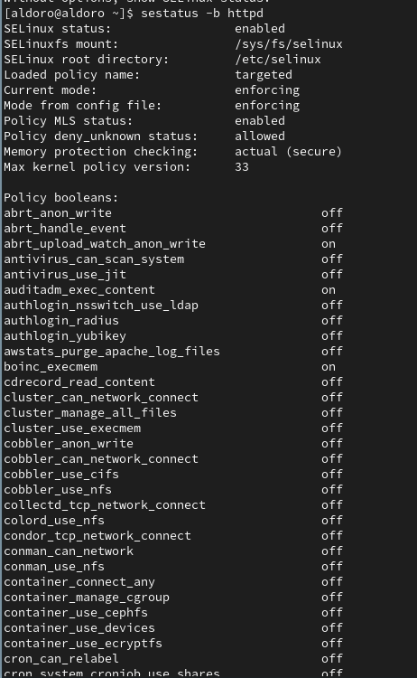{#fig:10 width=70%}

5. Посмотрите статистику по политике с помощью команды `seinfo`, также
определите множество пользователей, ролей, типов (рис. @fig:11).

{#fig:11 width=70%}

Число пользователей = 8, ролей = 14, типов = 5100.

6. Определите тип файлов и поддиректорий, находящихся в директории
/var/www, с помощью команды `ls -lZ /var/www` (рис. @fig:12).

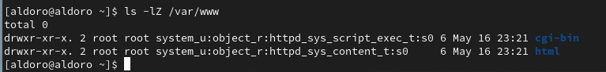{#fig:12 width=70%}

В каталоге находятся только директории.

7. Определите тип файлов, находящихся в директории /var/www/html: `ls -lZ /var/www/html` (рис. @fig:13).

{#fig:13 width=70%}

Директория пуста.

8. Определите круг пользователей, которым разрешено создание файлов в
директории /var/www/html - это только пользователь root.

9. Создайте от имени суперпользователя (так как в дистрибутиве после установки только ему разрешена запись в директорию) html-файл
/var/www/html/test.html следующего содержания (рис. @fig:14):

```
<html>
<body>test</body>
</html>
```

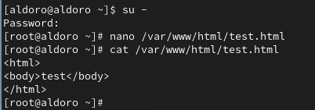{#fig:14 width=70%}

10. Проверьте контекст созданного вами файла. Занесите в отчёт контекст,
присваиваемый по умолчанию вновь созданным файлам в директории
/var/www/html (рис. @fig:15).

{#fig:15 width=70%}

Контекст безопасности - **httpd_sys_content_t**.

11. Обратитесь к файлу через веб-сервер, введя в браузере адрес
http://127.0.0.1/test.html (рис. @fig:16). Файл был успешно отображён.

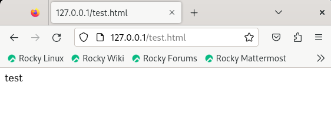{#fig:16 width=70%}

12. Изучите справку man httpd_selinux и выясните, какие контексты файлов определены для httpd. 

Сопоставьте их с типом файла test.html. Проверить контекст файла можно командой `ls -Z /var/www/html/test.html` (рис. @fig:17). Контекст безопасности файла - **httpd_sys_content_t**. Данный контекст входит в перечень контекстов безопасности httpd.

Роль **object_r** используется по умолчанию для файлов на «постоянных» носителях и на сетевых файловых системах. Тип **httpd_sys_content_t** позволяет процессу httpd получить доступ к файлу. Благодаря наличию последнего типа мы получили доступ к файлу при обращении к нему через браузер.

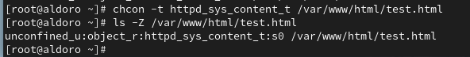{#fig:17 width=70%}

13. Измените контекст файла /var/www/html/test.html с httpd_sys_content_t на любой другой, к которому процесс httpd не должен иметь доступа, например, на samba_share_t (рис. @fig:18): 

```
chcon -t samba_share_t /var/www/html/test.html
ls -Z /var/www/html/test.html
```

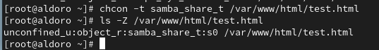{#fig:18 width=70%}

Видим, что контекст безопасности действительно изменился.

14. Попробуйте ещё раз получить доступ к файлу через веб-сервер, введя в
браузере адрес http://127.0.0.1/test.html (рис. @fig:19). 

Мы получили сообщение об ошибке: **Forbidden You don't have permission to access /test.html on this server.**

{#fig:19 width=70%}

15. Проанализируйте ситуацию. Почему файл не был отображён, если права
доступа позволяют читать этот файл любому пользователю?
`ls -l /var/www/html/test.html` (рис. @fig:20) - нет доступа к файлу из-за недопустимого контекста безопасности для httpd.

Просмотрите log-файлы веб-сервера Apache. Также просмотрите системный лог-файл: `tail /var/log/messages` (рис. @fig:20).

Если в системе окажутся запущенными процессы setroubleshootd и
audtd (рис. @fig:20), то вы также сможете увидеть ошибки, аналогичные указанным
выше, в файле /var/log/audit/audit.log (рис. @fig:21).

{#fig:22 width=70%}

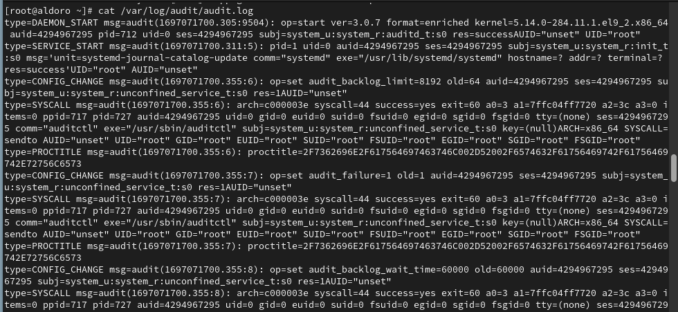{#fig:23 width=70%}

16. Попробуйте запустить веб-сервер Apache на прослушивание ТСР-порта
81 (а не 80, как рекомендует IANA и прописано в /etc/services). Для
этого в файле /etc/httpd/httpd.conf найдите строчку Listen 80 и
замените её на Listen 81 (рис. @fig:22).

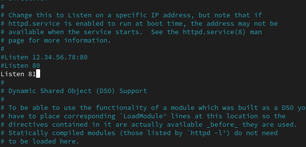{#fig:22 width=70%}

17. Выполните перезапуск веб-сервера Apache (рис. @fig:23). Произошёл сбой? Поясните
почему?

{#fig:23 width=70%}

Ошибки не возникает, поскольку в изначальных настройках системы порт 81 уже был прописан в рекомендациях системы.

18. Проанализируйте лог-файлы:
`tail -nl /var/log/messages` - нет никаких ошибок (рис. @fig:24).
Просмотрите файлы `/var/log/http/error_log` (рис. @fig:25),
`/var/log/http/access_log` (рис. @fig:26) и `/var/log/audit/audit.log` (рис. @fig:27) и
выясните, в каких файлах появились записи - нет записей об ошибках, т.к. нет ошибок.

{#fig:24 width=70%}

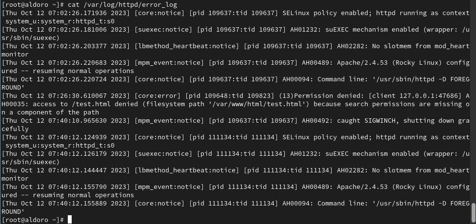{#fig:25 width=70%}

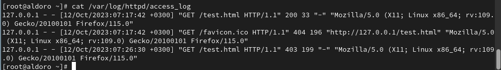{#fig:26 width=70%}

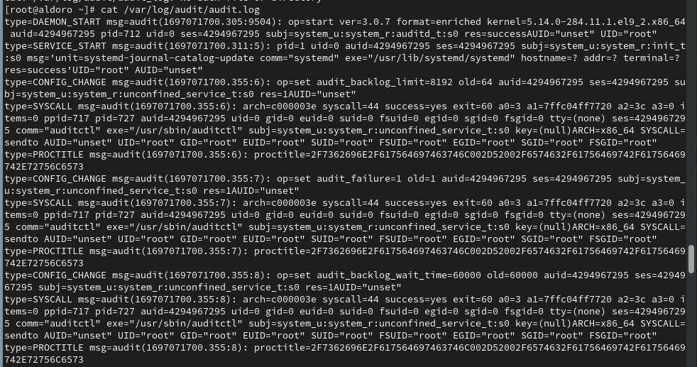{#fig:27 width=70%}

19. Выполните команду `semanage port -a -t http_port_t -р tcp 81`
После этого проверьте список портов командой
`semanage port -l | grep http_port_t` (рис. @fig:28). Добавление порта не производим, т.к. нам известно, что он и так уже добвлен - сразу смотрим список.

Порт 81 есть в списке.

{#fig:28 width=70%}

20. Попробуйте запустить веб-сервер Apache ещё раз. Поняли ли вы, почему
он сейчас запустился, а в предыдущем случае не смог?

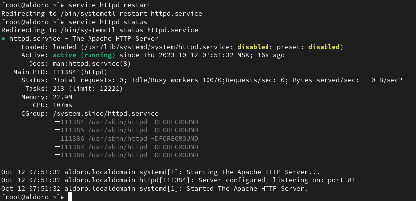{#fig:29 width=70%}

Сервер перезапустился также успешно, как и в тот раз, посколько оба раза порт 81 был в списке портов.

21. Верните контекст httpd_sys_cоntent__t к файлу /var/www/html/ test.html:
`chcon -t httpd_sys_content_t /var/www/html/test.html` (рис. @fig:30).

После этого попробуйте получить доступ к файлу через веб-сервер, введя в браузере адрес http://127.0.0.1:81/test.html (рис. @fig:31).

Видим содержимое файла — слово «test».

{#fig:30 width=70%}

{#fig:31 width=70%}

22. Исправьте обратно конфигурационный файл apache, вернув Listen 80 (рис. @fig:32).

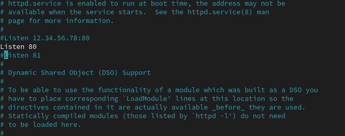{#fig:32 width=70%}

23. Удалите привязку http_port_t к 81 порту:
semanage port -d -t http_port_t -p tcp 81
и проверьте, что порт 81 удалён.

Мы не можем этого сделать, поскольку это была изначальная настройка системы.
(рис. @fig:33).

24. Удалите файл /var/www/html/test.html (рис. @fig:33): `rm /var/www/html/test.html`

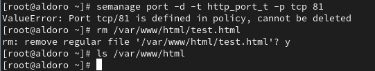{#fig:33 width=70%}

# Выводы

Развила навыки администрирования ОС Linux. Получила первое практическое знакомство с технологией SELinux1. Проверила работу SELinx на практике совместно с веб-сервером Apache.

# Список литературы{.unnumbered}

::: {#refs}
:::
