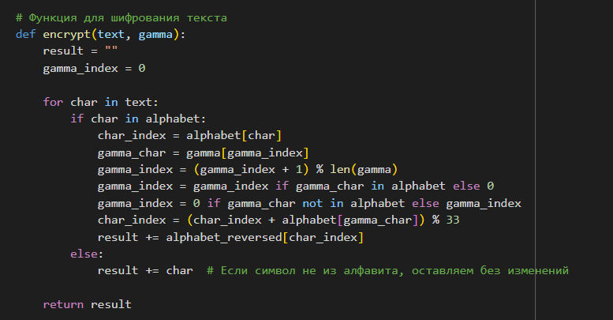
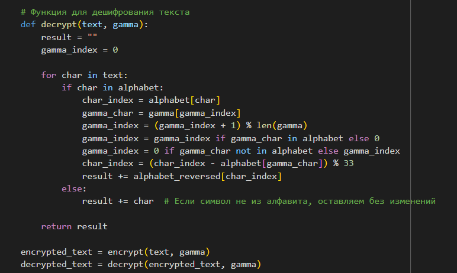
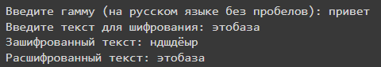

---
## Front matter
lang: ru-RU
title: Лабораторная работа №7
subtitle: Элементы криптографии. Однократное гаммирование
author:
  - Дорофеева А.Т.
institute:
  - Российский университет дружбы народов им. Патриса Лумумбы, Москва, Россия
date: 21 октября 2023

## i18n babel
babel-lang: russian
babel-otherlangs: english

## Formatting pdf
toc: false
toc-title: Содержание
slide_level: 2
aspectratio: 169
section-titles: true
theme: metropolis
header-includes:
 - \metroset{progressbar=frametitle,sectionpage=progressbar,numbering=fraction}
 - '\makeatletter'
 - '\beamer@ignorenonframefalse'
 - '\makeatother'
---

# Информация

## Докладчик

:::::::::::::: {.columns align=center}
::: {.column width="70%"}

  * Дорофеева Алёна Тимофеевна
  * студент группы НПИбд-01-20
  * Российский университет дружбы народов им. Патриса Лумумбы
  * [1032201392@pfur.ru](mailto:1032201392@pfur.ru)
  * <https://github.com/DorofeevaAT/study_2022-2023_infosec>

:::
::: {.column width="30%"}

:::
::::::::::::::

# Вводная часть

## Актуальность

- Криптография – это важнейший инструмент кибербезопасности, она обеспечивает дополнительный уровень защиты, позволяет сохранить конфиденциальность данных и предотвращает их перехват киберпреступниками

## Объект и предмет исследования

- Принцип одногратного гаммирования

## Цели и задачи

1. Изучить принцип однократного гаммирования
2. Разработать приложение, позволяющее шифровать и дешифровать данные в режиме однократного гаммирования

## Материалы и методы

- Однократное гаммирование

# Выполнение работы

## Функция кодирования

{width=70%}

## Функция декодирования

{width=70%}

## Работа программы

{width=70%}

# Результаты

## Результат

1. Изучен принцип однократного гаммирования
2. Разработано приложение, позволяющее шифровать и дешифровать данные в режиме однократного гаммирования

# Вывод

## Вывод

Я освоила на практике применение режима однократного гаммирования. Разработала приложение, позволяющее шифровать и дешифровать данные в режиме однократного гаммирования.