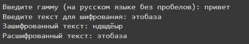

---
## Front matter
title: "Отчет по лабораторной работе №7"
subtitle: "Дисциплина: Информационная безопасность"
author: "Дорофеева Алёна Тимофеевна"

## Generic otions
lang: ru-RU
toc-title: "Содержание"

## Bibliography
bibliography: bib/cite.bib
csl: pandoc/csl/gost-r-7-0-5-2008-numeric.csl

## Pdf output format
toc: true # Table of contents
toc-depth: 2
lof: true # List of figures
lot: true # List of tables
fontsize: 12pt
linestretch: 1.5
papersize: a4
documentclass: scrreprt
## I18n polyglossia
polyglossia-lang:
  name: russian
  options:
	- spelling=modern
	- babelshorthands=true
polyglossia-otherlangs:
  name: english
## I18n babel
babel-lang: russian
babel-otherlangs: english
## Fonts
mainfont: PT Serif
romanfont: PT Serif
sansfont: PT Sans
monofont: PT Mono
mainfontoptions: Ligatures=TeX
romanfontoptions: Ligatures=TeX
sansfontoptions: Ligatures=TeX,Scale=MatchLowercase
monofontoptions: Scale=MatchLowercase,Scale=0.9
## Biblatex
biblatex: true
biblio-style: "gost-numeric"
biblatexoptions:
  - parentracker=true
  - backend=biber
  - hyperref=auto
  - language=auto
  - autolang=other*
  - citestyle=gost-numeric
## Pandoc-crossref LaTeX customization
figureTitle: "Рис."
tableTitle: "Таблица"
listingTitle: "Листинг"
lofTitle: "Список иллюстраций"
lotTitle: "Список таблиц"
lolTitle: "Листинги"
## Misc options
indent: true
header-includes:
  - \usepackage{indentfirst}
  - \usepackage{float} # keep figures where there are in the text
  - \floatplacement{figure}{H} # keep figures where there are in the text
---

# Цель работы

Освоить на практике применение режима однократного гаммирования.

# Задачи

1. Изучить принцип однократного гаммирования.

2. Разработать приложение, позволяющее шифровать и дешифровать данные в режиме однократного гаммирования.

# Теоретическое введение

Шифрование гаммированием – это метод шифрования, который основан на использовании гаммы [@key-1].

Гамма шифра – это псевдослучайная последовательность, выработанная по определенному алгоритму для шифрования открытых данных и дешифрования зашифрованных данных. Она играет роль ключа в одноразовой система шифрования. Строго говоря, она не удовлетворяет ни требованию случайности, так как используется детерминированный алгоритм для ее выработки, ни требованию бесконечной длины, так как все псевдослучайные последовательности имеют конечный период. Тем не менее, при правильно выбранном алгоритме генерации гаммы шифра можно получить метод шифрования с хорошей практической стойкостью, достаточной для решения реальных задач защиты информации [@key-2].

Наложение гаммы по сути представляет собой выполнение операции
сложения по модулю 2 (XOR) между элементами
гаммы и элементами подлежащего сокрытию текста[@key-3].

# Выполнение лабораторной работы

1. Разработаем приложение, позволяющее шифровать и дешифровать данные в режиме однократного гаммирования (код выполнен на языке программирования Python): 

```
def main():
    # Создаем алфавит
    alphabet = {
        "а": 1, "б": 2, "в": 3, "г": 4, "д": 5, "е": 6, "ё": 7, "ж": 8, "з": 9, "и": 10,
        "й": 11, "к": 12, "л": 13, "м": 14, "н": 15, "о": 16, "п": 17, "р": 18, "с": 19, "т": 20,
        "у": 21, "ф": 22, "х": 23, "ц": 24, "ч": 25, "ш": 26, "щ": 27, "ъ": 28, "ы": 29, "ь": 30,
        "э": 31, "ю": 32, "я": 33
    }

    # Меняем местами ключи и значения для дешифрования
    alphabet_reversed = {v: k for k, v in alphabet.items()}

    gamma = input("Введите гамму (на русском языке без пробелов): ").lower()
    text = input("Введите текст для шифрования: ").lower()

    # Функция для шифрования текста
    def encrypt(text, gamma):
        result = ""
        gamma_index = 0

        for char in text:
            if char in alphabet:
                char_index = alphabet[char]
                gamma_char = gamma[gamma_index]
                gamma_index = (gamma_index + 1) % len(gamma)
                gamma_index = gamma_index if gamma_char in alphabet else 0
                gamma_index = 0 if gamma_char not in alphabet else gamma_index
                char_index = (char_index + alphabet[gamma_char]) % 33
                result += alphabet_reversed[char_index]
            else:
                result += char  # Если символ не из алфавита, оставляем без изменений

        return result

    # Функция для дешифрования текста
    def decrypt(text, gamma):
        result = ""
        gamma_index = 0

        for char in text:
            if char in alphabet:
                char_index = alphabet[char]
                gamma_char = gamma[gamma_index]
                gamma_index = (gamma_index + 1) % len(gamma)
                gamma_index = gamma_index if gamma_char in alphabet else 0
                gamma_index = 0 if gamma_char not in alphabet else gamma_index
                char_index = (char_index - alphabet[gamma_char]) % 33
                result += alphabet_reversed[char_index]
            else:
                result += char  # Если символ не из алфавита, оставляем без изменений

        return result

    encrypted_text = encrypt(text, gamma)
    decrypted_text = decrypt(encrypted_text, gamma)

    print("Зашифрованный текст:", encrypted_text)
    print("Расшифрованный текст:", decrypted_text)

if __name__ == "__main__":
    main()

```
В качестве примера зашифруем текст "этобаза" (рис. @fig:1). 
Затем полученный результат пробуем расшифровать тем же ключом (рис. @fig:1). Видим, что все успешно расшифровалось (рис. @fig:1). Затем определяем ключ, с помощью которого шифротекст может быть преобразован в некоторый фрагмент текста, представляющий собой один из возможных вариантов прочтения открытого текста (рис. @fig:1). Для этого используем функцию дешифровки, передавая ей исходный текст и то, что получилось в зашифрованном варианте (рис. @fig:1). 

{#fig:1 width=70%}

# Выводы

Освоила на практике применение режима однократного гаммирования.

# Список литературы{.unnumbered}

::: {#refs}
:::
