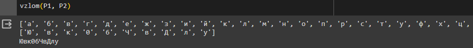

---
## Front matter
lang: ru-RU
title: Лабораторная работа №8
subtitle: Элементы криптографии. Шифрование (кодирование) различных исходных текстов одним ключом
author:
  - Дорофеева А.Т.
institute:
  - Российский университет дружбы народов им. Патриса Лумумбы, Москва, Россия
date: 25 октября 2023

## i18n babel
babel-lang: russian
babel-otherlangs: english

## Formatting pdf
toc: false
toc-title: Содержание
slide_level: 2
aspectratio: 169
section-titles: true
theme: metropolis
header-includes:
 - \metroset{progressbar=frametitle,sectionpage=progressbar,numbering=fraction}
 - '\makeatletter'
 - '\beamer@ignorenonframefalse'
 - '\makeatother'
---

# Информация

## Докладчик

:::::::::::::: {.columns align=center}
::: {.column width="70%"}

  * Дорофеева Алёна Тимофеевна
  * студент группы НПИбд-01-20
  * Российский университет дружбы народов им. Патриса Лумумбы
  * [1032201392@pfur.ru](mailto:1032201392@pfur.ru)
  * <https://github.com/DorofeevaAT/study_2022-2023_infosec>

:::
::: {.column width="30%"}

:::
::::::::::::::

# Вводная часть

## Актуальность

- Криптография – это важнейший инструмент кибербезопасности, она обеспечивает дополнительный уровень защиты, позволяет сохранить конфиденциальность данных и предотвращает их перехват киберпреступниками

## Объект и предмет исследования

- Принцип одногратного гаммирования

## Цели и задачи

1. Изучить принцип однократного гаммирования для кодирования двух исходных текстов одним ключом

2. Разработать приложение, позволяющее шифровать и дешифровать тексты P1 и P2 в режиме однократного гаммирования

## Материалы и методы

- Однократное гаммирование

## Гаммирование

Гаммирование – это наложение (снятие) на открытые (зашифрованные) данные криптографической гаммы, т.е. последовательности элементов данных, вырабатываемых с помощью некоторого криптографического алгоритма, для получения зашифрованных (открытых) данных.

## Алгоритм взлома

Шифротексты обеих телеграмм можно получить по формулам режима однократного гаммирования:

$$C_1 = P_1 \oplus K$$
$$C_2 = P_2 \oplus K$$

## Алгоритм взлома

Открытый текст можно найти, зная шифротекст двух телеграмм, зашифрованных одним ключом. Для это оба равенства складываются по модулю 2. Тогда с учётом свойства операции XOR получаем:

$$C_1 \oplus C_2 = P_1 \oplus  K \oplus  P_2 \oplus  K = P_1 \oplus P_2$$

## Алгоритм взлома

Предположим, что одна из телеграмм является шаблоном — т.е. имеет текст фиксированный формат, в который вписываются значения полей.
Допустим, что злоумышленнику этот формат известен. 
Тогда он получает достаточно много пар $C_1 \oplus C_2$ (известен вид обеих шифровок).
Тогда зная $P_1$ имеем:

$$C_1 \oplus C_2 \oplus P_1 = P_1 \oplus P_2 \oplus P_1 = P_2$$ 

## Пример работы программы

{ #fig:002 }

{ #fig:003 }

# Выводы

## Результаты выполнения лабораторной работы

В ходе выполнения лабораторной работы было разработано приложение, позволяющее шифровать тексты в режиме однократного гаммирования.